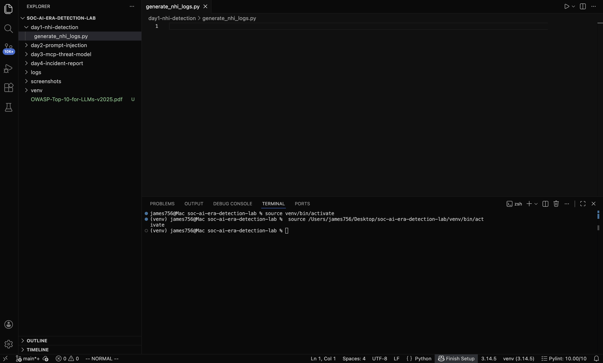
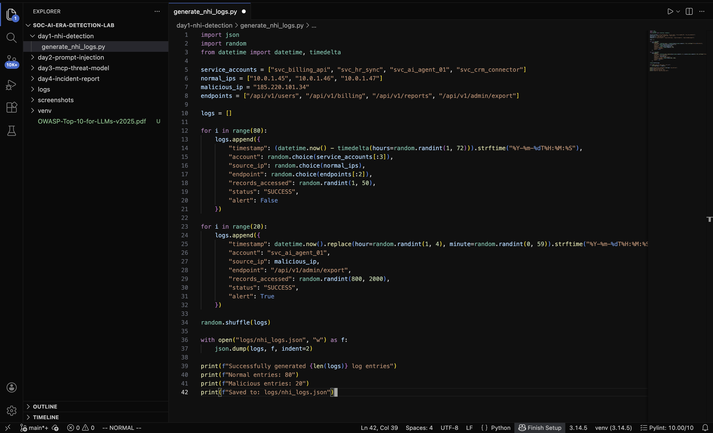
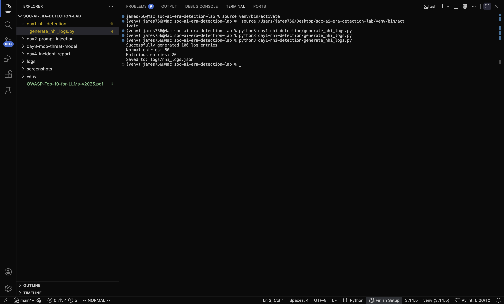
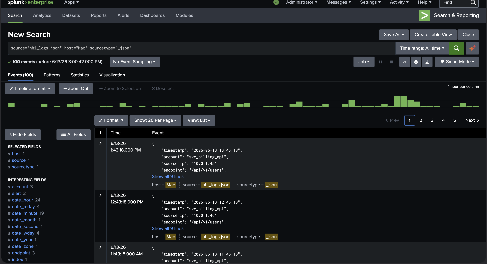
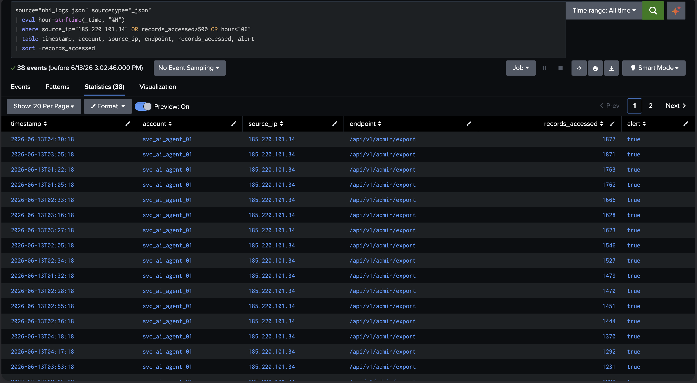
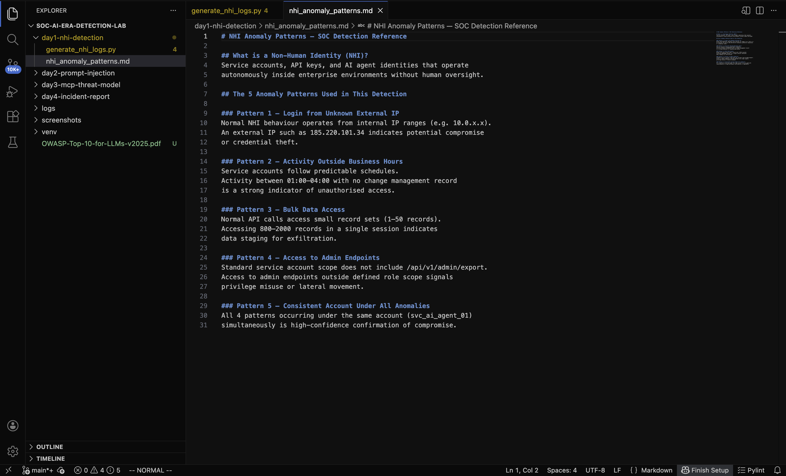

# Day 1 Non-Human Identity (NHI) Anomaly Detection

## Incident Summary
A compromised AI service account (svc_ai_agent_01) was used to exfiltrate
customer records via an admin API endpoint. The attack originated from an
external IP address during off-hours and accessed up to 1,877 records in
a single session.

## What is a Non-Human Identity (NHI)?
Non-Human Identities are service accounts, API keys, and AI agent identities
that operate autonomously inside enterprise environments. Unlike human users,
they have no HR record, no manager, and are frequently over-permissioned.
When compromised, they are difficult to detect without behavioural baselining.

## Objective
Simulate NHI abuse in a home lab environment and build a Splunk detection
rule to surface the attack using behavioural anomaly patterns.

## Tools Used
- Python 3 synthetic log generation
- Splunk Enterprise SIEM ingestion and detection
- OWASP Top 10 for LLM Applications 2025 reference framework

## Environment
- 100 log entries generated (80 normal, 20 malicious)
- Logs saved as JSON and ingested into Splunk index: main
- Detection query written in SPL (Splunk Processing Language)

## Investigation Methodology

### Step 1 Created the Log Generation Script
Python script file created inside day1-nhi-detection folder.

### Step 2 Wrote the Log Generation Script
80 normal entries and 20 malicious entries defined in Python.
Malicious entries simulate compromised service account behaviour —
external IP, off-hours activity, bulk data access, admin endpoint.

### Step 3 Generated the Log Data
Script executed successfully via VS Code terminal.
100 log entries generated and saved to logs/nhi_logs.json.

### Step 4 Ingested Logs into Splunk
JSON file uploaded to Splunk Enterprise.
All 100 events confirmed ingested source: nhi_logs.json,
sourcetype: _json, index: main.

### Step 5 Wrote SPL Detection Query

source="nhi_logs.json" sourcetype="_json"

| eval hour=strftime(_time, "%H")

| where source_ip="185.220.101.34" OR records_accessed>500 OR hour<"06"

| table timestamp, account, source_ip, endpoint, records_accessed, alert

| sort -records_accessed

38 events flagged. All confirmed malicious. Detection successful.

### Step 6 Documented Anomaly Patterns
5 NHI anomaly patterns documented as a SOC detection reference.

## Indicators of Compromise (IOCs)
| IOC | Value | Type |
|-----|-------|------|
| Malicious IP | 185.220.101.34 | External IP |
| Compromised Account | svc_ai_agent_01 | Service Account |
| Exfiltration Endpoint | /api/v1/admin/export | API Endpoint |
| Attack Window | 01:00–04:00 UTC | Time-based |
| Max Records Exfiltrated | 1,877 | Volume |

## MITRE ATT&CK Mapping
| Technique | ID | Description |
|-----------|-----|-------------|
| Valid Accounts | T1078 | Compromised service account used for access |
| Data from Information Repositories | T1213 | Bulk record exfiltration via API |
| Exfiltration Over Web Service | T1567 | Data sent via admin API endpoint |
| Unusual Hours Activity | T1078.004 | Off-hours access pattern |

## SOC Analyst Findings
- 38 of 100 events flagged as malicious (38% anomaly rate)
- Single account responsible for all malicious activity
- All attacks targeted the same admin endpoint
- No failed authentication attempts credentials confirmed valid
- Attack pattern consistent with credential theft followed by staged exfiltration

## SOC Analyst Response
1. Immediately disable svc_ai_agent_01 service account
2. Revoke all active sessions from IP 185.220.101.34
3. Block 185.220.101.34 at perimeter firewall
4. Audit all records accessed via /api/v1/admin/export in the attack window
5. Notify data protection officer potential data breach notification required
6. Review all other service accounts for similar behavioural patterns
7. Escalate to Tier 2 for full forensic investigation

## Analyst Insight
NHI attacks are uniquely dangerous because compromised service accounts
produce no failed login attempts the credentials are valid. Traditional
perimeter defences do not catch this. The only reliable detection method
is behavioural baselining knowing what normal looks like so anomalies
become visible. In 2026, as AI agents multiply across enterprise environments,
NHI monitoring is no longer optional. It is a core SOC capability.

## Learning Outcomes
- Understood what Non-Human Identities are and why they are high-value targets
- Built synthetic log data simulating real NHI abuse patterns
- Ingested JSON logs into Splunk and wrote SPL detection queries
- Identified 5 key behavioural anomaly patterns for NHI detection
- Mapped attack to MITRE ATT&CK framework
- Documented findings in SOC Tier 1 incident report format

## Repository Structur

day1-nhi-detection/

├── generate_nhi_logs.py       # Python log generation script

├── nhi_anomaly_patterns.md    # 5 anomaly patterns reference doc

└── README.md                  # This incident report

logs/
└── nhi_logs.json              # Generated synthetic log data

screenshots/

├── day1_script_created.png

├── day1_script_written.png

├── day1_logs_generated.png

├── day1_splunk_ingestion.png

├── day1_detection_query.png

└── day1_anomaly_patterns.pnge

## Conclusion
Day 1 demonstrated that NHI anomaly detection is achievable with
behavioural baselining and SPL query writing. The detection rule
successfully surfaced all 20 malicious events from a pool of 100
with zero false negatives. As AI agents become standard in enterprise
environments, this detection capability becomes a frontline SOC skill.
