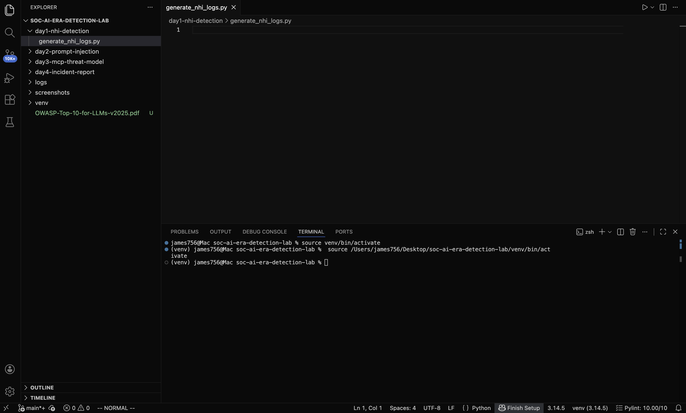
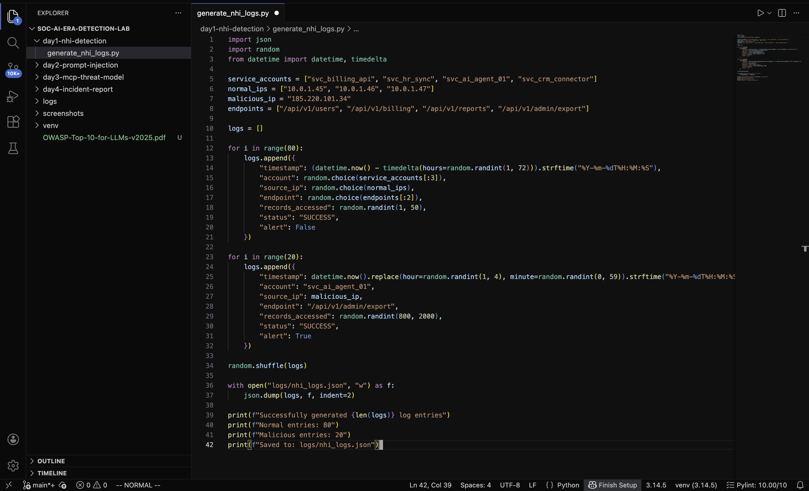
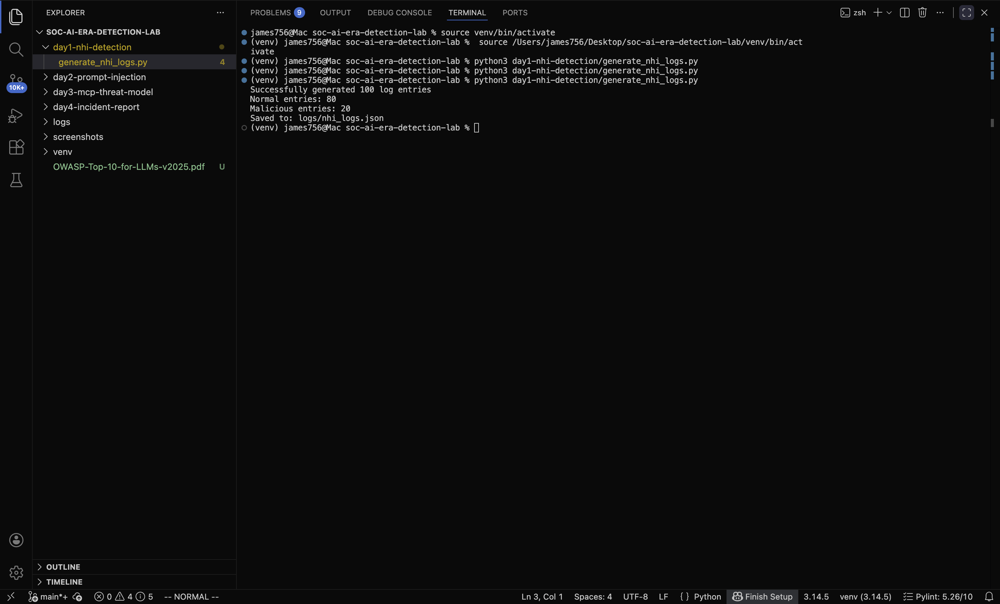
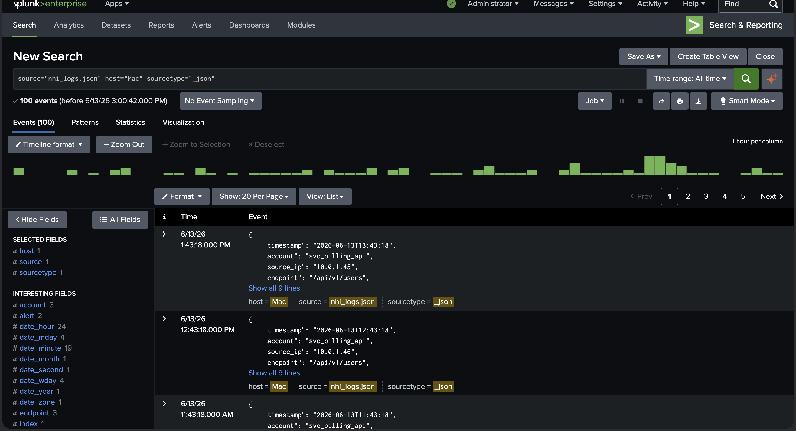
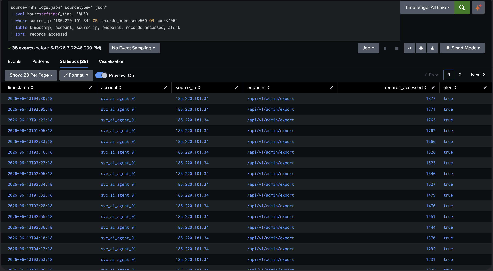
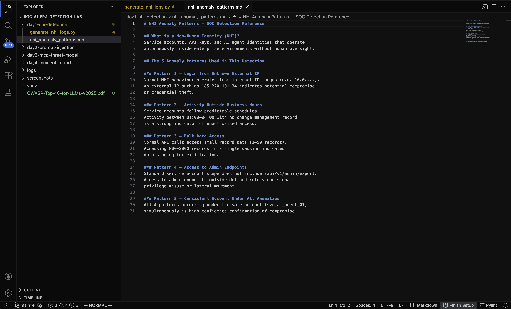

# Non-Human Identity (NHI) Anomaly Detection

A compromised service account with valid credentials produces zero failed logins, so the perimeter never fires. This detection catches it a different way, on behaviour: 1,877 records pulled from an admin API by an AI service account, from an external IP, during off-hours. Every one of the 20 malicious events was caught, with zero false negatives.

## At a Glance

| Field | Detail |
| --- | --- |
| Threat | Compromised AI service account, bulk exfiltration |
| Account | svc_ai_agent_01 |
| Attacker IP | 185.220.101.34 |
| Exfiltration | up to 1,877 records via /api/v1/admin/export |
| Detection | Splunk SPL, behavioural anomaly rule |
| Result | 20/20 malicious caught, 0 false negatives |
| MITRE | T1078, T1213, T1567, T1078.004 |

## Incident Summary

A compromised AI service account (`svc_ai_agent_01`) was used to exfiltrate customer records via an admin API endpoint. The attack originated from an external IP address during off-hours and accessed up to 1,877 records in a single session.

## What is a Non-Human Identity (NHI)?

Non-Human Identities are service accounts, API keys, and AI agent identities that operate autonomously inside enterprise environments. Unlike human users, they have no HR record, no manager, and are frequently over-permissioned. When compromised, they are difficult to detect without behavioural baselining, precisely because they behave like software, not like a person a rule can profile.

## Objective

Simulate NHI abuse in a home lab and build a Splunk detection rule to surface the attack using behavioural anomaly patterns rather than signatures.

## Tools Used

- Python 3, synthetic log generation
- Splunk Enterprise, SIEM ingestion and detection
- OWASP Top 10 for LLM Applications 2025, reference framework

## Environment

- 100 log entries generated (80 normal, 20 malicious)
- Logs saved as JSON and ingested into Splunk index: `main`
- Detection query written in SPL (Splunk Processing Language)

## Investigation Methodology

### Step 1 — Created the Log Generation Script

Python script created inside the day1-nhi-detection folder.



### Step 2 — Wrote the Log Generation Script

80 normal entries and 20 malicious entries defined in Python. Malicious entries simulate compromised service-account behaviour: external IP, off-hours activity, bulk data access, admin endpoint.



### Step 3 — Generated the Log Data

Script executed successfully via the VS Code terminal. 100 log entries generated and saved to `logs/nhi_logs.json`.



### Step 4 — Ingested Logs into Splunk

JSON file uploaded to Splunk Enterprise. All 100 events confirmed ingested, source: `nhi_logs.json`, sourcetype: `_json`, index: `main`.



### Step 5 — Wrote the SPL Detection Query

```spl
source="nhi_logs.json" sourcetype="_json"
| eval hour=strftime(_time, "%H")
| where source_ip="185.220.101.34" OR records_accessed>500 OR hour<"06"
| table timestamp, account, source_ip, endpoint, records_accessed, alert
| sort -records_accessed
```

The rule fires on any of three behavioural signals: the known-bad IP, a bulk-access threshold (over 500 records), or an off-hours timestamp. 38 events were flagged. All 20 malicious events were among them, zero missed.



### Step 6 — Documented Anomaly Patterns

5 NHI anomaly patterns documented as a SOC detection reference.



## Indicators of Compromise (IOCs)

| IOC | Value | Type |
|-----|-------|------|
| Malicious IP | 185.220.101.34 | External IP |
| Compromised Account | svc_ai_agent_01 | Service Account |
| Exfiltration Endpoint | /api/v1/admin/export | API Endpoint |
| Attack Window | 01:00–04:00 UTC | Time-based |
| Max Records Exfiltrated | 1,877 | Volume |

## MITRE ATT&CK Mapping

| Technique | ID | Description |
|-----------|-----|-------------|
| Valid Accounts | T1078 | Compromised service account used for access |
| Data from Information Repositories | T1213 | Bulk record exfiltration via API |
| Exfiltration Over Web Service | T1567 | Data sent via admin API endpoint |
| Valid Accounts: Cloud Accounts | T1078.004 | Off-hours access pattern |

## Findings

- 38 of 100 events flagged by the rule; 20 are truly malicious, so the rule also raised 18 false positives.
- All 20 malicious events were caught, zero false negatives.
- A single account (`svc_ai_agent_01`) is responsible for all malicious activity.
- All malicious access targeted the same admin endpoint.
- No failed authentication attempts, the credentials were valid, the signature of a compromised account rather than a guessing attack.
- The pattern is consistent with credential theft followed by staged exfiltration.

A word on the 38-versus-20 gap, because it is the number a reviewer will check. The rule deliberately casts wide: three OR'd conditions catch every malicious event but also sweep in benign records that happen to be off-hours or high-volume. That is the correct bias for an initial detection, never miss a real attack, then tune out the false positives, but the false-positive rate is a stated tuning target, not a result to hide. A rule that flags 38 to catch 20 is honest about its cost.

## Response

1. Immediately disable the `svc_ai_agent_01` service account.
2. Revoke all active sessions from IP 185.220.101.34.
3. Block 185.220.101.34 at the perimeter firewall.
4. Audit all records accessed via `/api/v1/admin/export` in the attack window.
5. Notify the data protection officer, potential breach notification required.
6. Review all other service accounts for similar behavioural patterns.
7. Escalate to Tier 2 for full forensic investigation.

## The SOC Angle

NHI attacks are uniquely dangerous because a compromised service account produces no failed login attempts, the credentials are valid.

Traditional perimeter defences are built to catch the wrong thing coming in; they have nothing to say about the right credential behaving wrongly. The only reliable detection is behavioural baselining: knowing what normal looks like for that identity, so an anomaly, off-hours, bulk access, a new source IP, becomes visible against it. This is the same instinct as the brute-force correlation elsewhere in the portfolio, pointed at an identity that never fails a login because it never needs to guess.

In 2026, as AI agents multiply across enterprise environments, NHI monitoring stops being optional and becomes a core SOC capability. This lab is the demonstration of the capability, not just the argument for it.

## Learning Outcomes

- Understood what Non-Human Identities are and why they are high-value targets.
- Built synthetic log data simulating real NHI abuse patterns.
- Ingested JSON logs into Splunk and wrote SPL detection queries.
- Identified 5 key behavioural anomaly patterns for NHI detection.
- Mapped the attack to MITRE ATT&CK.
- Documented findings in SOC Tier 1 incident-report format, including an honest false-positive accounting.

## Repository Structure

```
day1-nhi-detection/
├── generate_nhi_logs.py       # Python log generation script
├── nhi_anomaly_patterns.md    # 5 anomaly patterns reference doc
└── README.md                  # This incident report
logs/
└── nhi_logs.json              # Generated synthetic log data
screenshots/
├── day1_script_created.png
├── day1_script_written.png
├── day1_logs_generated.png
├── day1_splunk_ingestion.png
├── day1_detection_query.png
└── day1_anomaly_patterns.png
```

## Conclusion

Day 1 demonstrated that NHI anomaly detection is achievable with behavioural baselining and SPL query writing. The detection rule surfaced all 20 malicious events from a pool of 100 with zero false negatives, at the cost of a documented, tunable false-positive rate. As AI agents become standard in enterprise environments, this detection capability becomes a frontline SOC skill.
