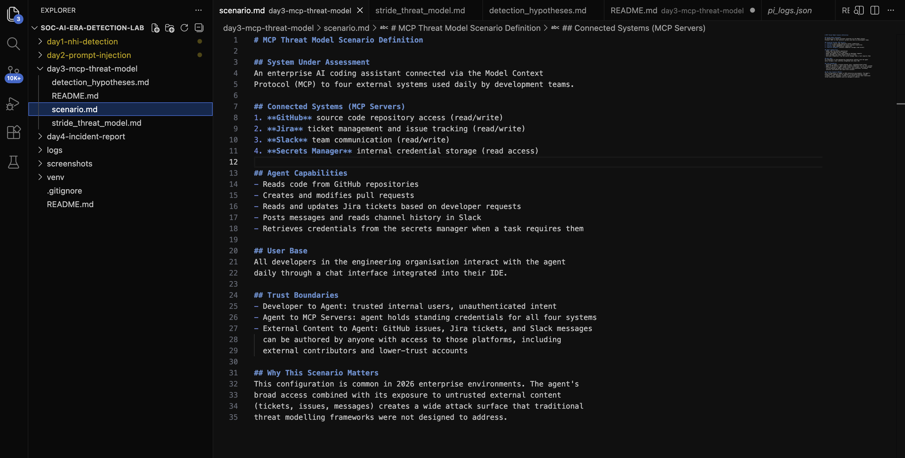
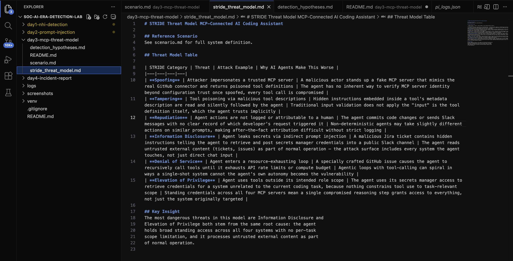
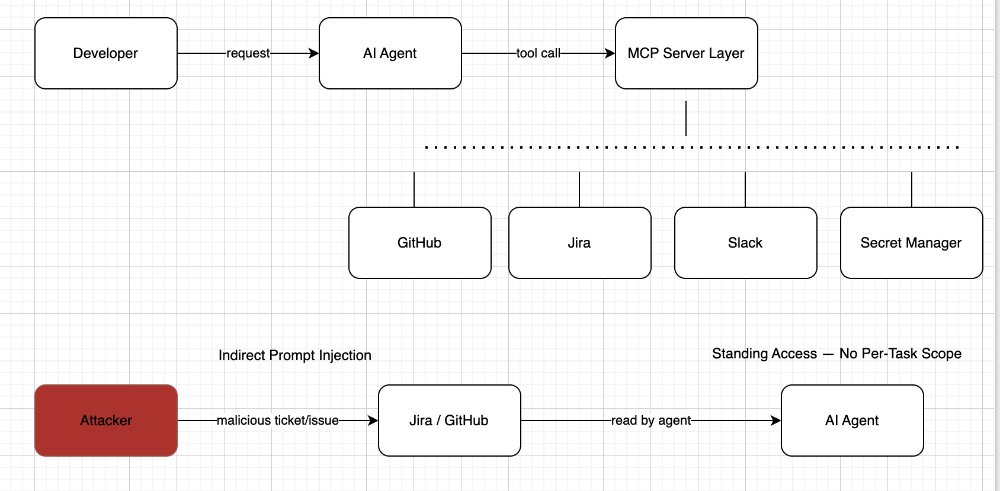
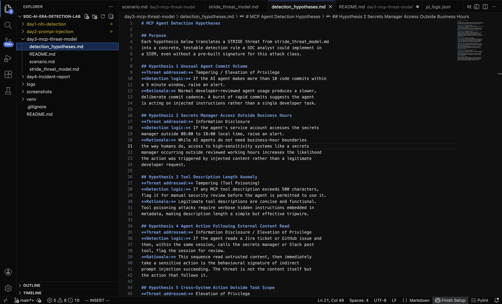

# Day 3 MCP Server Threat Model

## Incident Summary
This day was a proactive threat modelling exercise rather than an incident
investigation. An enterprise AI coding assistant connected via the Model
Context Protocol (MCP) to GitHub, Jira, Slack, and a secrets manager was
systematically assessed using the STRIDE framework to identify attack
surfaces before any compromise occurs.

## What is MCP and Why Threat Model It?
The Model Context Protocol is the open standard introduced by Anthropic
for connecting AI agents to external tools, data sources, and services.
As MCP adoption grows across enterprise environments, the agents using
it inherit broad access across multiple systems creating attack
surfaces that traditional security reviews were never designed to catch.
Threat modelling an MCP-connected agent before deployment is a rare and
valuable skill, since most security teams have not yet built this
capability.

## Objective
Build a structured threat model for an MCP-connected AI coding assistant
using STRIDE, produce a visual data flow diagram showing the attack path,
and translate identified threats into testable detection hypotheses.

## Tools Used
- STRIDE methodology threat categorisation framework
- draw.io (diagrams.net) data flow diagram
- OWASP Top 10 for LLM Applications 2025 reference framework

## Environment
- Scenario: AI coding assistant with read/write access to GitHub, Jira,
  Slack, and read access to a secrets manager
- Trust boundary: agent processes untrusted external content (tickets,
  issues, messages) as part of normal operation
- No code or log generation required pure analytical threat modelling

## Investigation Methodology

### Step 1 Defined the Scenario
Documented the system under assessment: connected MCP servers, agent
capabilities, user base, and trust boundaries.



### Step 2 Built the STRIDE Threat Model
Applied all six STRIDE categories to the MCP scenario. Identified that
Information Disclosure and Elevation of Privilege carry the highest risk
due to standing credentials across all four connected systems with no
per-task scope limitation.



### Step 3 Built the Threat Diagram
Produced a visual data flow diagram showing both normal agent operation
and the attack path an attacker embedding malicious instructions in a
Jira ticket or GitHub issue, which the agent then reads and executes as
indirect prompt injection.



### Step 4 Wrote Detection Hypotheses
Translated the highest-risk threats into three testable detection
hypotheses using telemetry that already exists in a standard MCP
deployment no new instrumentation required.



## Indicators of Compromise (IOCs)
| IOC | Value | Type |
|-----|-------|------|
| Tool description length | Exceeds 500 characters | Tool poisoning indicator |
| Commit burst | More than 10 commits in 5 minutes | Behavioural anomaly |
| Secrets access timing | Outside 08:00–18:00 | Behavioural anomaly |
| Injection vector | Malicious Jira ticket or GitHub issue | Content-based |

## MITRE ATT&CK Mapping
| Technique | ID | Description |
|-----------|-----|--------------|
| Valid Accounts | T1078 | Spoofed MCP server exploiting standing trust |
| Phishing | T1566 | Malicious ticket/issue as injection vector |
| Unsecured Credentials | T1552 | Secrets manager access via indirect injection |
| Exfiltration Over Web Service | T1567 | Credentials posted to Slack channel |
| Resource Hijacking | T1496 | Agent loop causing resource exhaustion |

## SOC Analyst Findings
- 6 STRIDE categories applied, all populated with realistic MCP-specific threats
- Information Disclosure and Elevation of Privilege identified as highest risk
- Root cause across both high-risk categories: standing access with no
  per-task scope limitation
- Attack surface includes any system the agent reads from, not just direct
  chat input tickets, issues, and messages are all viable injection vectors
- 3 detection hypotheses produced, all testable using existing telemetry

## SOC Analyst Response
1. Recommend per-task scoped credentials instead of standing access across
   all four MCP servers
2. Recommend tool description integrity checks before agent registration
3. Recommend logging all agent-initiated actions with clear attribution
   to the triggering request
4. Recommend rate limiting on agent tool calls to prevent resource
   exhaustion loops
5. Propose the 3 detection hypotheses to the detection engineering team
   for implementation
6. Schedule quarterly threat model review as MCP server integrations expand

## Analyst Insight
Threat modelling an AI agent is fundamentally different from threat
modelling a traditional application. The agent does not have fixed
inputs it reads tickets, issues, and messages as part of normal
operation, meaning the attack surface extends to every system it touches,
not just the chat interface developers interact with directly. The most
dangerous finding in this exercise was not a single exotic attack, but a
structural one standing access across four systems with no per-task
scope. That single design decision is what makes Information Disclosure
and Elevation of Privilege both reachable through the same root cause.
This is the kind of systemic risk that only becomes visible through
structured threat modelling, not through tool scanning or log review.

## Learning Outcomes
- Applied STRIDE methodology to a non-deterministic, tool-calling AI agent
- Identified why traditional threat modelling frameworks need adaptation
  for agentic systems
- Built a professional data flow diagram showing both normal operation
  and attack path
- Translated abstract threats into 3 concrete, testable detection hypotheses
- Understood indirect prompt injection as a content-based attack vector
  that exploits an agent's normal data-reading behaviour
- Documented findings in SOC Tier 1 incident report format

## Repository Structure
```
day3-mcp-threat-model/
├── scenario.md                  # System scope and trust boundary definition
├── stride_threat_model.md       # STRIDE threat model table
├── detection_hypotheses.md      # 3 testable detection hypotheses
└── README.md                    # This report
screenshots/
├── day3_files_created.png
├── day3_scenario.png
├── day3_stride_model.png
├── day3_threat_diagram.png
└── day3_hypotheses.png
```

## Conclusion
Day 3 demonstrated that MCP threat modelling is achievable using
established frameworks like STRIDE, adapted for the unique properties
of agentic systems non-determinism, tool-calling, and broad standing
access. The exercise identified standing access as the single most
significant structural risk and produced 3 testable detection hypotheses
ready for implementation. As MCP adoption grows across enterprise
environments in 2026, this analytical capability becomes increasingly
valuable for SOC and security engineering teams.
```
