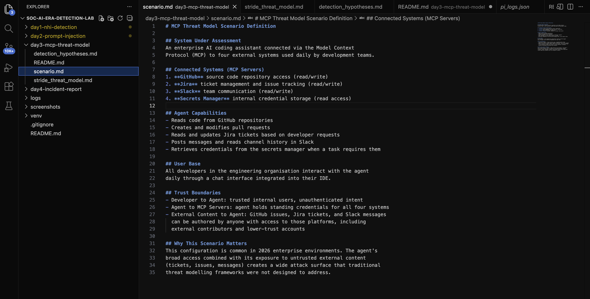
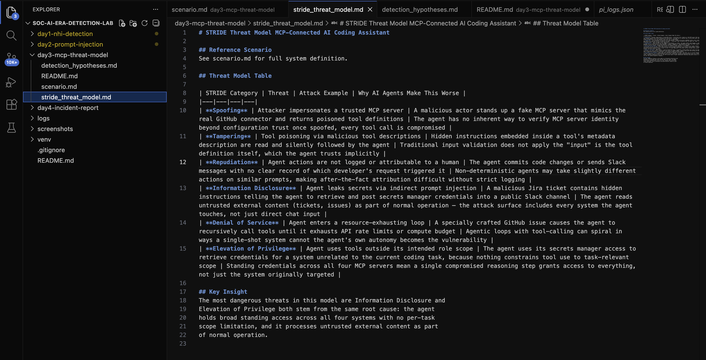
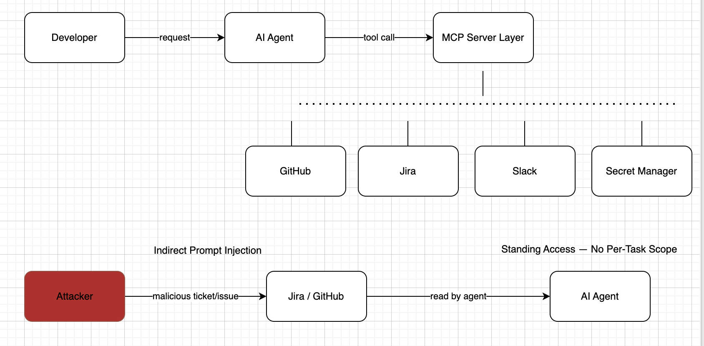
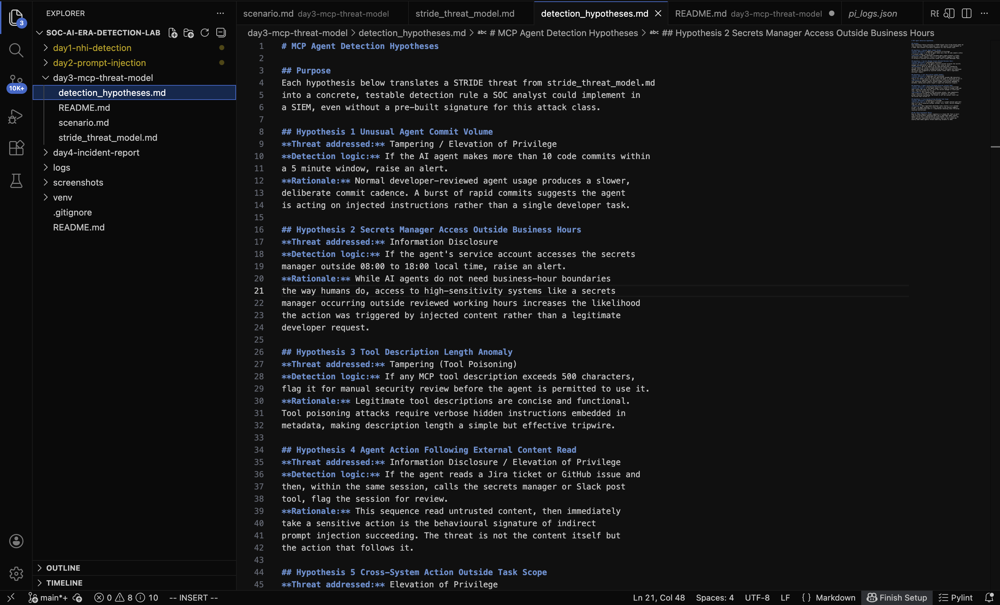

# MCP Server Threat Model

One design decision, two high-risk threats. An AI coding agent with standing access across GitHub, Jira, Slack, and a secrets manager was assessed with STRIDE before any compromise, and the most dangerous finding was not an exotic attack, it was the structural one: standing credentials with no per-task scope, the single root cause that makes both Information Disclosure and Elevation of Privilege reachable. This is the day the lab shifts from detecting attacks to preventing them.

## At a Glance

| Field | Detail |
| --- | --- |
| Work Type | Proactive threat modelling, pre-deployment |
| System | MCP-connected AI coding agent |
| Connected servers | GitHub, Jira, Slack, secrets manager |
| Framework | STRIDE, all 6 categories |
| Top risk | Information Disclosure + Elevation of Privilege |
| Root cause | Standing access, no per-task scope |
| Output | 3 testable detection hypotheses, existing telemetry |
| MITRE | T1078, T1566, T1552, T1567, T1496 |

## Incident Summary

This day was a proactive threat-modelling exercise rather than an incident investigation. An enterprise AI coding assistant connected via the Model Context Protocol (MCP) to GitHub, Jira, Slack, and a secrets manager was systematically assessed using the STRIDE framework to identify attack surfaces before any compromise occurs.

## What is MCP and Why Threat Model It?

The Model Context Protocol is the open standard introduced by Anthropic for connecting AI agents to external tools, data sources, and services. As MCP adoption grows across enterprise environments, the agents using it inherit broad access across multiple systems, creating attack surfaces that traditional security reviews were never designed to catch.

Threat modelling an MCP-connected agent before deployment is a rare and valuable skill, because most security teams have not yet built this capability. The agent is not a fixed-input application, it reads and acts on live external content, which breaks the assumptions a conventional review is built on.

## Objective

Build a structured threat model for an MCP-connected AI coding assistant using STRIDE, produce a visual data flow diagram showing the attack path, and translate identified threats into testable detection hypotheses.

## Tools Used

- STRIDE, threat categorisation framework
- draw.io (diagrams.net), data flow diagram
- OWASP Top 10 for LLM Applications 2025, reference framework

## Environment

- Scenario: AI coding assistant with read/write access to GitHub, Jira, Slack, and read access to a secrets manager
- Trust boundary: the agent processes untrusted external content (tickets, issues, messages) as part of normal operation
- No code or log generation required, pure analytical threat modelling

## Investigation Methodology

### Step 1 — Defined the Scenario

Documented the system under assessment: connected MCP servers, agent capabilities, user base, and trust boundaries.



### Step 2 — Built the STRIDE Threat Model

Applied all six STRIDE categories to the MCP scenario. Identified that Information Disclosure and Elevation of Privilege carry the highest risk, due to standing credentials across all four connected systems with no per-task scope limitation.



### Step 3 — Built the Threat Diagram

Produced a visual data flow diagram showing both normal agent operation and the attack path: an attacker embedding malicious instructions in a Jira ticket or GitHub issue, which the agent then reads and executes as indirect prompt injection.



### Step 4 — Wrote Detection Hypotheses

Translated the highest-risk threats into three testable detection hypotheses using telemetry that already exists in a standard MCP deployment, no new instrumentation required. Detections that need no new logging are the ones that actually get deployed, which is why the constraint was deliberate.



## Indicators of Compromise (IOCs)

| IOC | Value | Type |
|-----|-------|------|
| Tool description length | Exceeds 500 characters | Tool poisoning indicator |
| Commit burst | More than 10 commits in 5 minutes | Behavioural anomaly |
| Secrets access timing | Outside 08:00–18:00 | Behavioural anomaly |
| Injection vector | Malicious Jira ticket or GitHub issue | Content-based |

## MITRE ATT&CK Mapping

| Technique | ID | Description |
|-----------|-----|--------------|
| Valid Accounts | T1078 | Spoofed MCP server exploiting standing trust |
| Phishing | T1566 | Malicious ticket/issue as injection vector |
| Unsecured Credentials | T1552 | Secrets manager access via indirect injection |
| Exfiltration Over Web Service | T1567 | Credentials posted to Slack channel |
| Resource Hijacking | T1496 | Agent loop causing resource exhaustion |

## Findings

- All 6 STRIDE categories applied, each populated with realistic MCP-specific threats.
- Information Disclosure and Elevation of Privilege identified as the highest-risk categories.
- Root cause across both: standing access with no per-task scope limitation, one flaw, two reachable threats.
- The attack surface includes any system the agent reads from, not just direct chat input, tickets, issues, and messages are all viable injection vectors.
- 3 detection hypotheses produced, all testable using existing telemetry.

The finding worth dwelling on is the shared root cause. Most threat models produce a list of independent risks to be triaged separately. This one traced two of the highest-severity categories back to a single design decision, which changes the remediation entirely: scope the credentials per task and both threats shrink at once. Finding the one cause behind several findings is what separates a threat model from a checklist.

## Response

1. Recommend per-task scoped credentials instead of standing access across all four MCP servers.
2. Recommend tool-description integrity checks before agent registration.
3. Recommend logging all agent-initiated actions with clear attribution to the triggering request.
4. Recommend rate limiting on agent tool calls to prevent resource-exhaustion loops.
5. Propose the 3 detection hypotheses to the detection-engineering team for implementation.
6. Schedule a quarterly threat-model review as MCP server integrations expand.

## The SOC Angle

Threat modelling an AI agent is fundamentally different from threat modelling a traditional application, and the difference is the input.

A conventional app has fixed, developer-defined inputs. An MCP agent reads tickets, issues, and messages as part of normal operation, which means the attack surface extends to every system it touches, not just the chat interface. An attacker does not need to reach the agent directly, they leave a payload in a Jira ticket the agent will dutifully read, and this is indirect prompt injection, the more dangerous variant flagged in the Day 2 reference, realised here as an architectural exposure rather than a single input.

The most dangerous finding was not a single exotic attack but a structural one: standing access across four systems with no per-task scope. That one decision makes Information Disclosure and Elevation of Privilege both reachable through the same root cause. This is the kind of systemic risk that only becomes visible through structured threat modelling, never through a tool scan or a log review, and it is the finding a SOC that can only react would miss entirely.

## Learning Outcomes

- Applied STRIDE to a non-deterministic, tool-calling AI agent.
- Identified why traditional threat-modelling frameworks need adaptation for agentic systems.
- Built a professional data flow diagram showing both normal operation and the attack path.
- Translated abstract threats into 3 concrete, testable detection hypotheses.
- Understood indirect prompt injection as a content-based vector that exploits an agent's normal data-reading behaviour.
- Documented findings in SOC Tier 1 incident-report format.

## Repository Structure

```
day3-mcp-threat-model/
├── scenario.md                  # System scope and trust boundary definition
├── stride_threat_model.md       # STRIDE threat model table
├── detection_hypotheses.md      # 3 testable detection hypotheses
└── README.md                    # This report
screenshots/
├── day3_files_created.png
├── day3_scenario.png
├── day3_stride_model.png
├── day3_threat_diagram.png
└── day3_hypotheses.png
```

## Conclusion

Day 3 demonstrated that MCP threat modelling is achievable using established frameworks like STRIDE, adapted for the unique properties of agentic systems: non-determinism, tool-calling, and broad standing access. The exercise identified standing access as the single most significant structural risk and produced 3 testable detection hypotheses ready for implementation. As MCP adoption grows across enterprise environments in 2026, this analytical capability becomes increasingly valuable for SOC and security-engineering teams.
